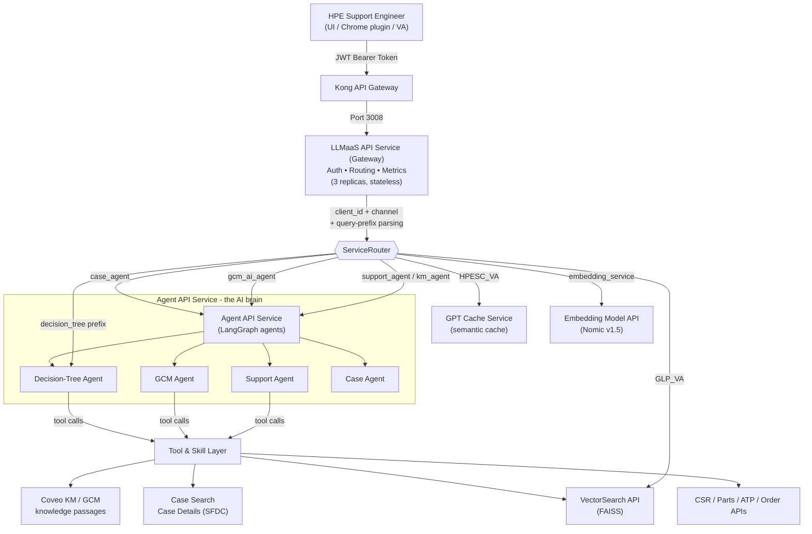

# HPE Support LLMaaS - AI Engineering & Architecture Document

> A deep, code-grounded description of the AI solution built for HPE Support Engineers. This document focuses on the **AI engineering** of the platform: the agents, their system prompts, the tools and skills they call, the RAG / retrieval stack, the caching layer, the observability and the AI testing/evaluation frameworks. Infrastructure and deployment are summarized briefly in the final section.

---

## 1. What This System Is and Who It Serves

This platform - internally called **LLMaaS (LLM-as-a-Service)** - is a multi-agent AI assistant built **for HPE Support Engineers**, not for end customers. That distinction is wired deep into the system: every agent persona is told that the user *is* a trained HPE professional, so the agents never say "contact HPE support", never talk down to the user, and always speak the technical language of the support floor. The goal of the platform is to make a support engineer's daily work materially easier by automating the two big categories of effort they face: **technical assistance** (troubleshooting hardware/software faults, reading logs, comparing firmware versions, drafting knowledge articles) and **process assistance** (navigating HPE's internal SOPs - dispatch, shipping, swarming, customer self-repair, GreenLake, and so on).

Rather than building one monolithic "chatbot", the team built a **fleet of specialized AI agents**, each tuned to a slice of the support engineer's job, all exposed behind a single authenticated gateway. A support engineer (or a UI/plugin acting on their behalf) sends a request to the gateway; the gateway decides which agent or service should handle it based on the caller's identity and channel; the agent reasons over the question, calls retrieval tools and structured back-end APIs as needed, grounds its answer in real HPE knowledge sources, and returns a cited, formatted response. Conversation state is preserved across turns so the engineer can have a genuine multi-turn troubleshooting dialogue.

The core engineering philosophy across all agents is **"never answer from the model's own memory."** Agents are explicitly forbidden from answering technical or process questions from their training knowledge - they must call a tool, retrieve grounded HPE content, and cite it. This is the single most important design decision in the system because it is what keeps the assistant trustworthy for engineers who are making real customer-impacting decisions.

---

## 2. The LLM Foundation (ChatHPE)

Every agent's reasoning is powered by HPE's internal LLM gateway, referred to in the code as **chatgpt**, accessed through a LangChain `AzureChatOpenAI`-compatible client. The client is configured in the standard HPE way so the agent code talks to one abstraction regardless of the underlying model deployment. The important point is that the model call is centralized: prompts, routing, and telemetry all flow through the same gateway layer rather than each agent calling a public endpoint directly.

That gateway is also where the platform keeps the LLM integration consistent across agents. It gives the team a single place to swap models, tune behavior, and capture usage details without changing the higher-level support workflows.

---

## 3. High-Level Architecture

At the highest level, there are five interconnected systems: the `gateway` (auth + routing), the `agent engine` (the four AI agents), a `vector search` service, a `semantic GPT cache`, and an `embedding` service. Everything AI-intensive happens inside the agent engine; the other four services are the supporting cast that the agents and the gateway lean on.

---

## 4. The Agent Layer (LangGraph)

All agents are built with **LangGraph** - each is a compiled state-machine graph of nodes and conditional edges, with conversation state persisted across turns. The agent layer is the part of the system that actually reasons about the support problem; the gateway routes requests, but the agents decide how to answer, what tools to call, and when to stop.

### 4.1 Support Agent - the technical + process hybrid

This is the primary general-purpose agent, and it is the graph most engineers hit first. It handles broad support questions that can involve both technical troubleshooting and internal process guidance, and it is designed to behave like a support-floor expert rather than a generic chatbot.

### 4.2 Decision-Tree Classifier Mode

This mode is used when the router needs a lightweight classifier to select the next agent path. The classifier helps route the query deterministically instead of letting the model free-form its way through the system.

The Support Agent prompt is tuned to keep the flow technical and grounded. It can ask follow-up questions, call retrieval tools, and switch between troubleshooting and process guidance, but it should never answer from memory.

The classifier path is intentionally small and cheap. Its job is just to label the request and hand control to the right downstream agent or service, not to generate the final answer itself.

### 4.3 Specialized Agent Paths

The screenshot also shows the start of the specialized agent definitions below the main support agent. These are the narrower routes for dedicated workflows like knowledge retrieval, case handling, and other HPE-specific support tasks.

### 4.4 GCM Agent - knowledge retrieval assistant

This agent is the dedicated retrieval path for HPE support knowledge. It is optimized for searching knowledge content, surfacing the right passages, and grounding its answer in cited source material instead of free-form generation.

### 4.5 Case Agent - support case specialist

This agent handles support case workflows and case details. It is used when the request needs case-oriented information rather than general troubleshooting or knowledge-base retrieval.

### 4.6 Image Analysis Mode - multimodal grounding

A cross-cutting core mode called `image_analysis` lets agents ingest attached images via OCR or a vision model. The image path is used when the engineer sends screenshots, photos, or other visual evidence that needs to be grounded before a support answer is generated.

The model does not try to reason about the image in the abstract. Instead, it extracts the visible text or visual cues, combines that with the rest of the conversation, and then uses the same grounded retrieval workflow as the text-only agents.

## 5. Skills, Tools, and Retrieval

The agent stack is not just a prompt wrapper; it is a tool-using system. Each agent can call skills and service APIs that do the actual work of fetching documents, searching cases, and grounding answers.

### 5.1 Skills - modular tool wrappers

The platform defines reusable skills for common actions. These are thin wrappers around support workflows, so the agent can invoke them by intent rather than hard-coding every API call inline.

### 5.2 Tool Routing and Retrieval

Retrieval is routed through the same tool layer every time. When an agent needs evidence, it asks for passages or structured data, and the system returns grounded results that can be cited in the final answer.

### 5.3 Image Analysis Tools

For image inputs, the skills layer can run OCR-style extraction or a vision-backed interpretation step before the agent continues. This keeps the grounding behavior consistent even when the source material is a screenshot instead of plain text.

## 6. The RAG / Retrieval Stack

The system uses a **multi-source RAG architecture** that blends a self-hosted vector store, an enterprise semantic search engine, and a semantic GPT cache. The agents never rely on memory alone; they retrieve first, then answer with citations.

### 6.1 Knowledge Retrieval (Coveo)

The richest retrieval path goes through **Coveo**, HPE's enterprise knowledge index, through several specialized clients. In practice this is the main route for support knowledge, internal articles, and grounded passages that the agents can cite.

### 6.2 Vector Search and Cache

When the request is a close semantic match or a repeated question, the system can also use vector search and cache-backed retrieval to answer faster while keeping the response grounded.

### 6.3 Self-hosted Vector Store

For content that lives outside the enterprise knowledge index, the platform uses a self-hosted vector store with HNSW / Annoy-style indexing and metadata filtering. This gives the agents a fast local retrieval path for embeddings-based search.

### 6.4 GPT Cache

The GPT cache sits alongside retrieval as a semantic shortcut. If the incoming question is highly similar to a prior one, the cache can return a validated answer path instead of re-running the full retrieval workflow.

The retrieval layer is intentionally designed to keep the support experience fast without sacrificing grounding. Even the shortcut paths still rely on source-backed content rather than model memory.

### 6.5 Structured Data Search and Case APIs

Beyond pure retrieval, agents can call structured back-end APIs for things like parts, firmware, and case records. This lets the system combine textual knowledge with live operational data when the answer needs more than a document passage.

### 6.6 API Retrieval and Status

Every tool call is tracked with a request/response status so the system can tell whether a search returned usable evidence, hit a cache, or failed cleanly. This keeps the agent honest about when it has grounded support and when it needs to try another path.

## 7. Semantic GPT Cache

The semantic GPT cache is the platform's shared answer-shortcut layer. It sits in front of repeated support questions and returns validated cached responses when the incoming request is close enough to a previously answered one.

The cache is backed by a semantic matching service rather than simple string equality, so it can catch paraphrases and near-duplicates. That makes it useful for high-frequency support questions where the exact wording changes but the intent stays the same.

This layer is treated as a helper to retrieval, not a replacement for it. When the cache is not confident enough, the request falls back to the normal agent-and-retrieval path.

## 8. Observability and Metrics

The platform tracks the health of the gateway, the agents, and the tool calls so support engineers can tell when the system is answering from grounded sources versus when it is falling back or retrying.

### 8.1 Request and response tracing

Each call through the stack carries traceable metadata, which makes it possible to follow a request from the gateway to the agent and then out to the retrieval or API layer.

### 8.2 Cache and retrieval signals

The observability layer records whether a response came from cache, from a retrieval-backed agent path, or from a direct structured-data lookup. That separation is important for debugging answer quality and system behavior.

### 8.3 Agent and workflow metrics

The system also tracks request latency, token usage, tool-call counts, cache hits, and other operational signals so the team can watch the health of the platform over time.

## 9. Testing and Evaluation

The platform treats AI quality as a first-class, automated concern across several layers.

### 9.1 Functional checks

These tests validate that agents choose the right tools, return grounded answers, and keep the conversation within the support-engineer domain.

### 9.2 Retrieval and grounding tests

The retrieval layer is tested to make sure that support answers actually come from source content and not from the model's internal memory.

### 9.3 Performance and load tests

The team also runs performance and load tests against the gateway, agent services, and supporting APIs so the system can be evaluated under realistic traffic.

### 9.4 Human review and rubric checks

The evaluation loop also includes human review for correctness, groundedness, faithfulness, and citation quality. That makes it easier to catch failures that simple automated checks might miss.

### 9.5 Summary of quality signals

Across the whole stack, the main quality signals are route correctness, groundedness, citation accuracy, latency, and overall support usefulness.

## 10. The Microservices, Summarized

The platform is split into a few tightly scoped services:

- `Gateway API Service`: auth, routing, metadata injection, metrics, and request normalization.
- `Agent API Service`: LangGraph agents that handle support reasoning and tool orchestration.
- `VectorSearch API`: semantic search over the vector store for grounded knowledge retrieval.
- `GPT Cache Service`: semantic cache for repeated or near-duplicate support questions.
- `Embedding Service`: embedding model access used by the retrieval stack.
- `Coveo / knowledge clients`: enterprise knowledge access for the richest support content.

## 11. Infrastructure & Deployment (brief)

The system is deployed as a set of stateless microservices behind the gateway layer. The gateway and agent services are designed to scale horizontally, while the retrieval and cache services stay isolated as supporting infrastructure.

The important deployment principle is simplicity: keep the AI brain in the agent service, keep the retrieval services separate, and keep the exposed gateway thin enough that it can route, authenticate, and observe traffic without becoming a bottleneck.
